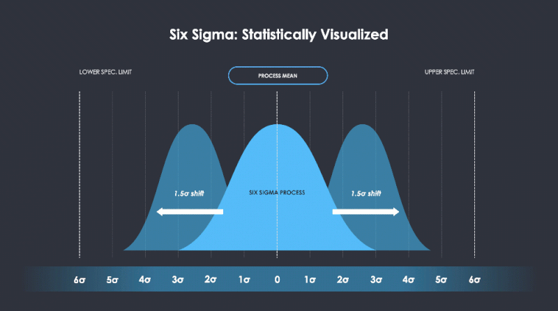
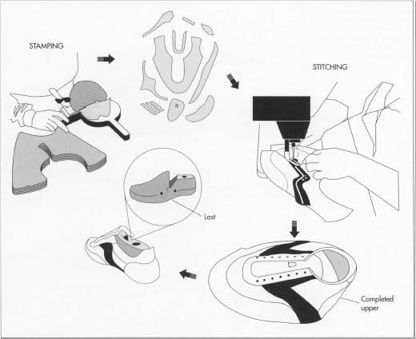
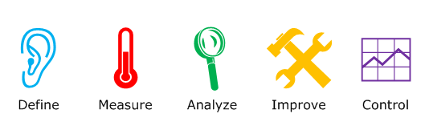
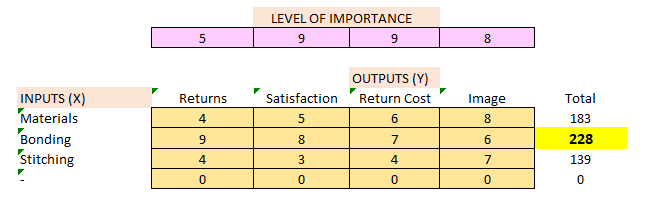
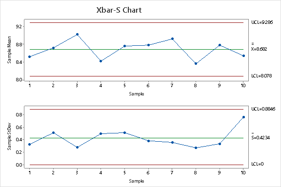
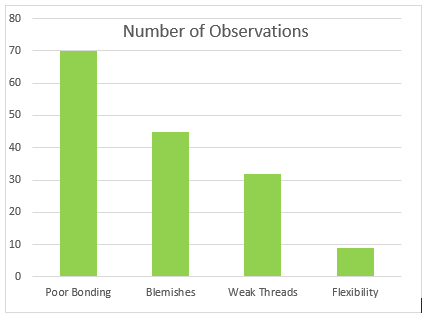
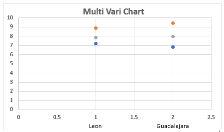
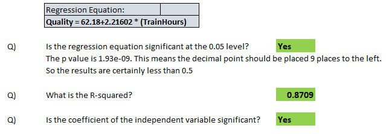

# Lean 6σ Green Belt Project: Process Improvement at Zoni Footwear Company using DMAIC Approach

#

# Company Background:
- Zoni Footwear designs and manufactures athletic shoes with two factories in Mexico. One is located in
Leon (Guanajuato) and the second in Guadalajara (Jalisco).

## Shoe Manufacturing Process

# Objective:
- Manufacturing Process Improvement using DMAIC approach for Quality Improvement & Process Optimization.

# LEAN Tools & Techniques Used:

## DMAIC 

## X-Y Matrix

## X_Bar & S Control Chart

## Ordered Histogram

## Multi Vari Analysis Between 2 Manufacturing Plants

## Linear Regression Output for Workforce Training vs. Product Quality Comparison

